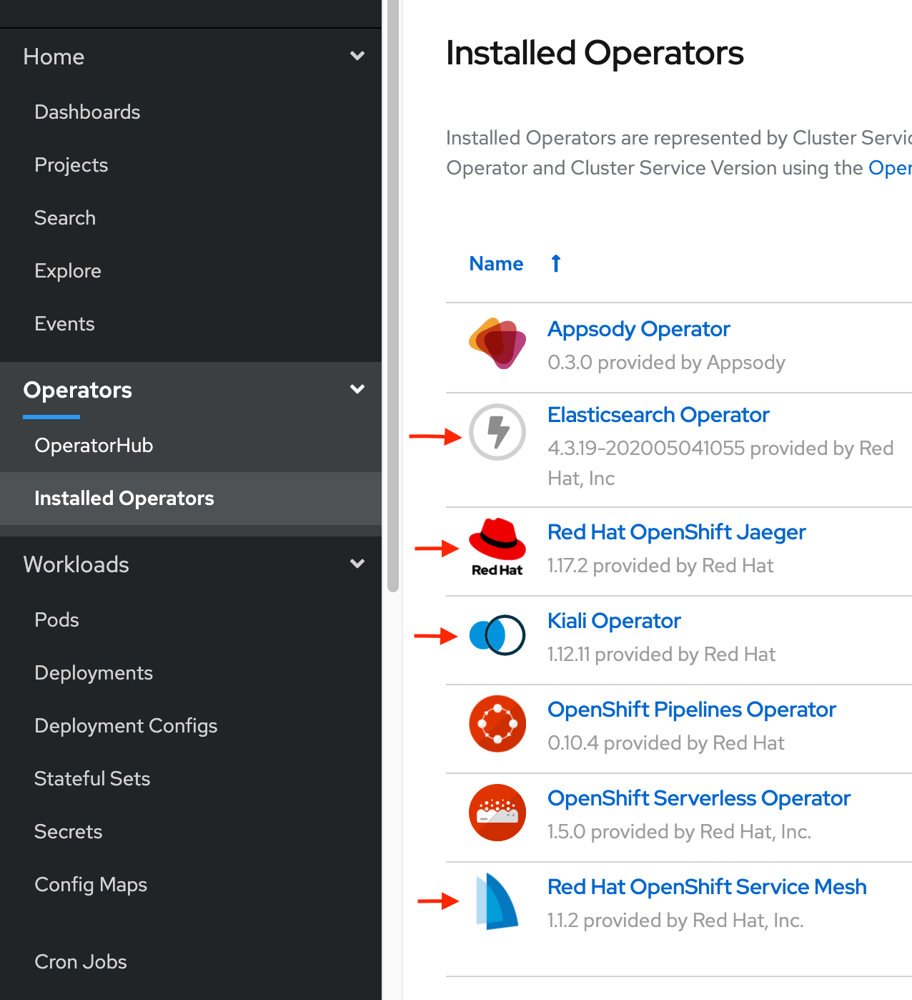
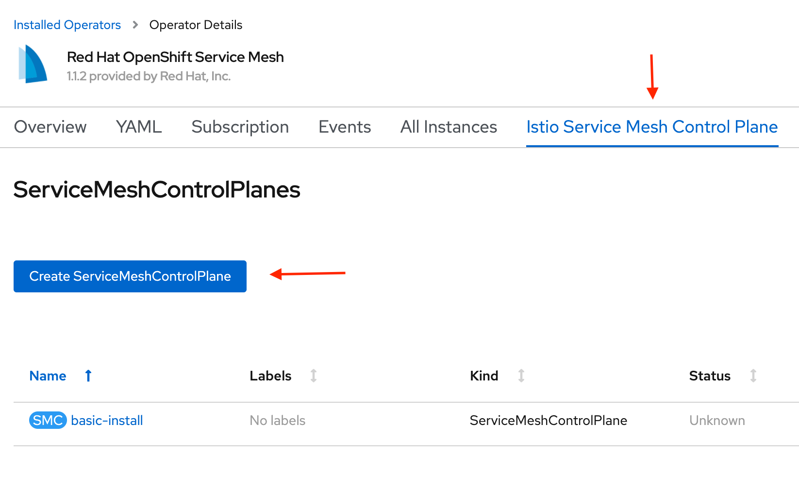
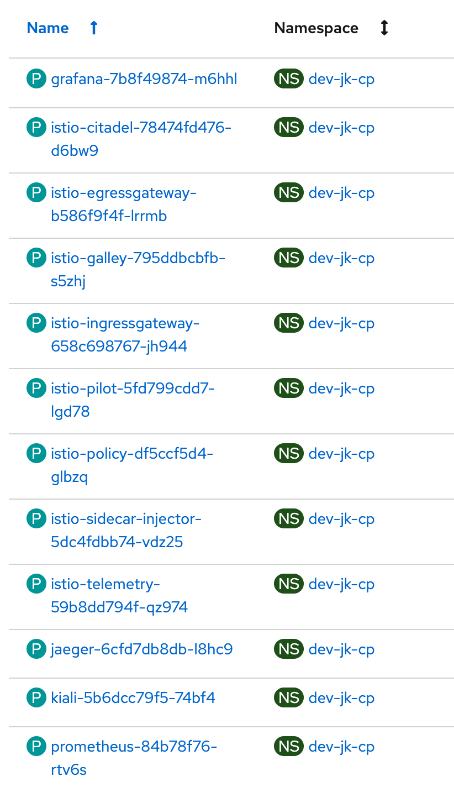
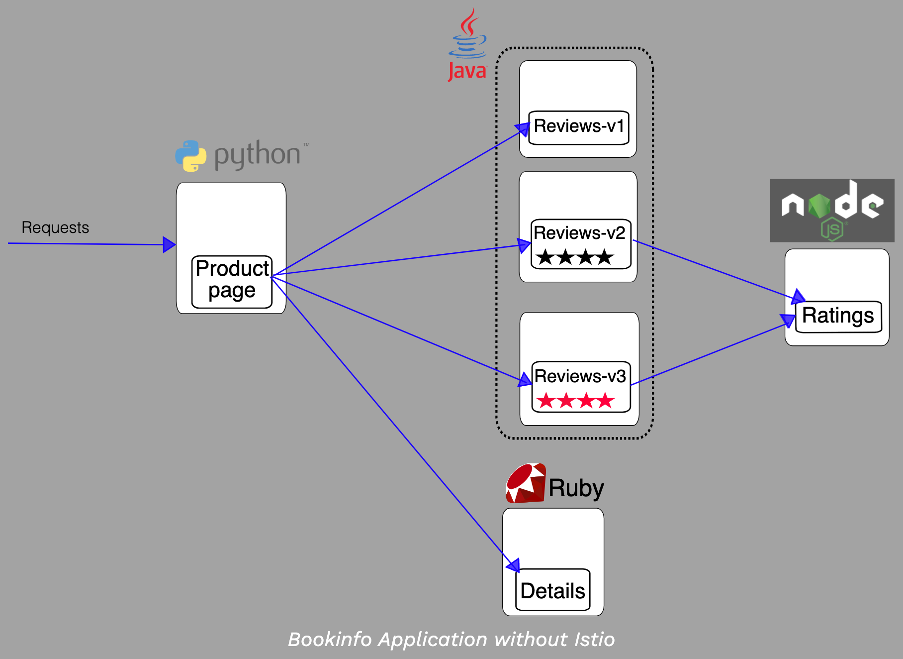
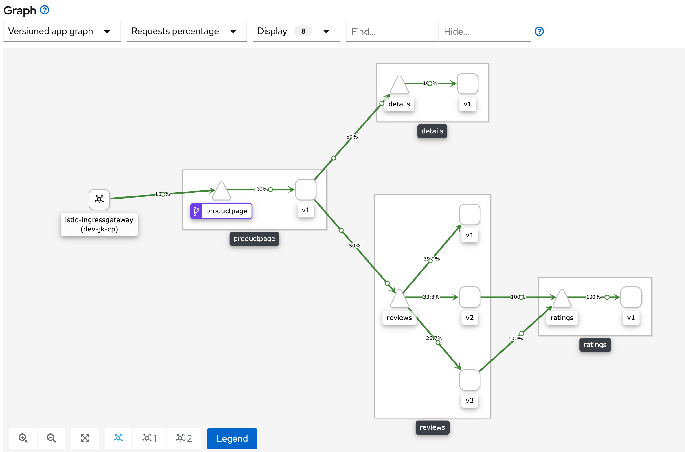
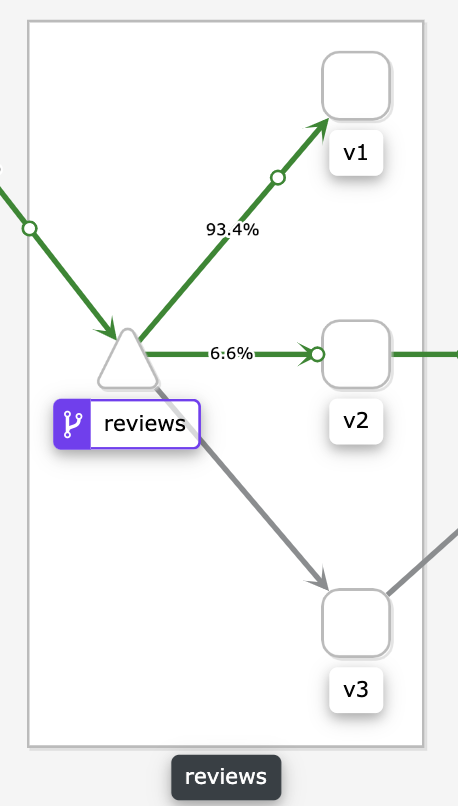
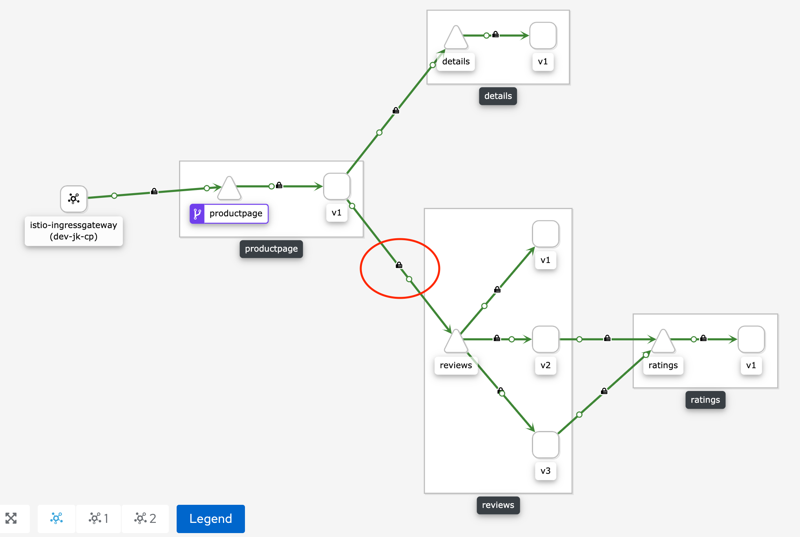

# OpenShift Service Mesh: Getting Started

## Why Use a Service Mesh?

OpenShift Service Mesh (OSSM) is based on the open source Istio project, and consists of several additional open source projects including Kiali, which provides a dashboard to visualize your microservice interactions; Jaeger, which provides distributed tracing; and Elasticsearch for logging.

A service mesh enables granular control over the networking layer of a distributed application, and vastly simplifies several Day 2 operational goals. These goals could include:

- A/B testing
- Canary rollouts
- Content-based traffic routing
- Circuit breaking
- Fault injection
- mTLS enforcement

For example, with a basic Kubernetes application deployment, it is impossible to perform a canary rollout of a new version of a microservice as traffic cannot be shaped beyond round robin load balancing at a service level. Istio, through the injection of sidecar proxies in each pod, can route and shape traffic with the simple application of routing rules via the service mesh control plane.

And most importantly for enterprises aspiring towards a cloud-native operational environment: a service mesh generally requires *no change* to underlying application code, thereby providing an abstraction layer that decouples the work of development and operations teams.

The demo described here will cover the installation of OpenShift Service Mesh, and will demonstrate how the service mesh aids in accomplishing several critical Day 2 operational goals.

## Prerequisites

- OpenShift 4.x cluster
- Account with `cluster-admin` role

#### Versioning in this demo
- OpenShift 4.3.18
- Elasticsearch 4.3.19
- Red Hat OpenShift Jaeger 1.17.2
- Kiali 1.12.11
- Red Hat OpenShift Service Mesh 1.1.2

## Installation Steps

1. This demo utilizes the Operator Catalog in OpenShift 4.x to create the necessary custom resources for OpenShift Service Mesh within the Kubernetes API server. Red Hat documents the installation steps here: [OSSM Install](https://docs.openshift.com/container-platform/4.3/service_mesh/service_mesh_install/installing-ossm.html)<br><br>

<br><br>Install the Elasticsearch operator first. Then install Jaeger and Kiali. Finally, install OSSM. The operators should be installed in the `openshift-operators` project. With OpenShift 4.x and the Operator Catalog, installation is quite simple. Check the OSSM link above for more details.

2. The OpenShift service mesh conists of a control plane and a data plane. Typically the control plane lives in a separate project on an OpenShift cluster. After installing the required operators, create a new project to hold the control plane (could name it `istio-system`), then navigate to the Installed Operators tab under Operators, find the OSSM and under Provided APIs -> Istio Service Mesh Control Plane click on Create Instance. Make sure to specify the project name holding the control plane under `metadata.namespace`.<br><br>
<br><br>After creating the control plane resource, check progress with `oc get smcp -n <istio-control-plane-project-name> -o wide`. In the version of OSSM used in this demo, the control plane should consist of 12 pods:<br><br>
<br><br>The service mesh has been successfully installed.

## Demo

### Basic Istio Features: Routing, Canary Deployments, A/B Testing

1. Once the service mesh control plane has been deployed, it's time to create an application and apply service mesh control. First, create a project for your application separate from the control plane project. Then, from the Installed Operators tab, click on the OSSM operator interface, and under Provided APIs -> Istio Service Mesh Member Roll select Create Instance. Add the name of the project where your application will be deployed to the member roll. 

2. This demo will use the [Bookinfo application](https://istio.io/docs/examples/bookinfo/) from the Istio project, and follow the steps outlined in [this GitHub page](https://github.com/tnscorcoran/openshift-servicemesh), which has commands adapted for OpenShift.<br><br> In the project intended for your application, create the resources for the Bookinfo project (deployment, services, and service accounts): `oc apply -f https://raw.githubusercontent.com/istio/istio/release-1.3/samples/bookinfo/platform/kube/bookinfo.yaml`<br><br>If not using the Bookinfo project, make sure to either label your deployment for Envoy sidecar injection, or run a label command at the namespace level by running `oc label project <your-project-name> istio-injection=enabled`
You can also do this at the deployment level for your app by specifying `spec.template.metadata.annotations.sidecar.istio.io/inject: "true"`
<br><br>Then apply sidecar injection by modifying the application deployment: `oc apply -f https://raw.githubusercontent.com/Maistra/bookinfo/maistra-1.0/bookinfo.yaml`<br><br>
Notice that in the Bookinfo application, the reviews microservice has three versions corresponding to three different container images, each of which is labeled with `version: <version-number>`.<br><br><br><br>Without Istio, traffic can only be routed to each version of a microservice according to the limited load balancing features of Kubernetes. As we'll see below, with a service mesh deployed, operations teams can easily route traffic to specific versions of a microservice.

3. Create an Istio gateway and virtual service. A gateway specifies the port and protocol that Istio should listen on for traffic entering the service mesh. Apply the gateway and virtual service rules in the namespace of the application: `oc apply -f https://raw.githubusercontent.com/Maistra/bookinfo/maistra-1.0/bookinfo-gateway.yaml`
<br><br>When Istio is installed, if ingress is enabled in your cluster, the pod labeled `istio=ingressgateway` in the namespace where the service mesh control plane is installed will listen for traffic at the cluster configured ingress IP and at the port specified in the gateway configuration. When traffic arrives at that IP and port, if an Istio virtual service exists referencing the gateway, and the traffic's URI matches one of the specified URIs in the virtual service spec, traffic will be routed to the service specified under `spec.<name-of-protocol>.match.route`.<br><br>For more on the gateway resource take a look at the [Istio documentation](https://istio.io/docs/concepts/traffic-management/#gateways).

4. Next, create Istio destination rules in the namespace of the application: `oc apply -f https://raw.githubusercontent.com/istio/istio/release-1.1/samples/bookinfo/networking/destination-rule-all.yaml `<br><br>Destination rules specify how traffic should be routed after it is forwarded to a particular service. In the Bookinfo example, since there are three deployed versions of the reviews microservice, each labeled with a different version number, destination rules specify how traffic arriving at the reviews service should be routed to the different versions of the backing pods. <br><br>Destination rules simplify the creation of virtual services and thus traffic routing in the mesh because they specify the specific labels of the backing pods for a particular service. The virtual service then only needs to specify the subsets of pods for which the traffic routing should be applied.

5. Identify the gateway URL: `oc -n <namespace-of-istio-system> get route istio-ingressgateway -o jsonpath='{.spec.host}'`
This URL will forward cluster external traffic to your service mesh and application. Add `/productpage` to the URL to view the application. Refresh the page a few times to send traffic to the mesh.

6. At this point, you should be able to visualize traffic flows in your application using Kiali. Visit the Kiali dashboard accessible via one of the exposed routes in the service mesh control plane project. Select Graph then select the namespace of your app. Under the dropdowns select Versioned app graph and enable traffic visualizations under Display -> Traffic Animation. You should see something like this:<br><br>


7. In this step, we'll apply traffic routing rules. [These virtual services resources](https://raw.githubusercontent.com/istio/istio/master/samples/bookinfo/networking/virtual-service-all-v1.yaml) instruct traffic to flow only to v1 of each of the microservices. Apply the rules with `oc apply -f https://raw.githubusercontent.com/istio/istio/master/samples/bookinfo/networking/virtual-service-all-v1.yaml`, then refresh the app. In the Kiali dashboard, traffic should only be flowing to pods labeled v1.

8. To demonstrate content-based routing, replace the reviews virtual service with one that routes traffic with the header `end-user=jason` to version v2 of the reviews microservice: `oc replace -f https://raw.githubusercontent.com/istio/istio/master/samples/bookinfo/networking/virtual-service-reviews-jason-v2-v3.yaml`<br><br>Log in with the username 'jason' and notice that you can only view reviews v2 (black stars). This virtual service also specifies all other traffic should be routed to v3 of the reviews microservice.

9. We can also apply traffic rules for a canary rollout that will send 90% of traffic to v1 and 10% to v2 of the reviews microservice:
`oc replace -f https://raw.githubusercontent.com/Maistra/istio/maistra-1.2/samples/bookinfo/networking/virtual-service-reviews-90-10.yaml`
<br><br> The yaml file can be modified to reflect any relative percentage of traffic flow. Refresh the application page a few times. The Kiali dashboard should reflect the rollout stats:


10. Finally, we can test our application for resiliency by injecting a fault into one of the services. `oc apply -f https://raw.githubusercontent.com/Maistra/istio/maistra-1.2/samples/bookinfo/networking/fault-injection-details-v1.yaml`<br><br>This specifies that calls to the details service should fail and return a 500 error. Refreshing the application page should reveal the details service error handling: 

#### Enabling mTLS

Using the sidecar Envoy proxy, Istio can greatly reduce the complexity involved in enabling security within the mesh.

From the Istio documentation:
>When a workload sends a request to another workload using mutual TLS authentication, the request is handled as follows:
>
>1. Istio re-routes the outbound traffic from a client to the client’s local sidecar Envoy.
>2. The client side Envoy starts a mutual TLS handshake with the server side Envoy. During the handshake, the client side Envoy also does a secure naming check to verify that the service account presented in the server certificate is authorized to run the target service.
>3. The client side Envoy and the server side Envoy establish a mutual TLS connection, and Istio forwards the traffic from the client side Envoy to the server side Envoy.
>4. After authorization, the server side Envoy forwards the traffic to the server service through local TCP connections.

Mutual authentication can be permissive or strict. In permissive mode, a service can receive both plaintext and TLS encrypted communication.

In this demo, we will apply destination rules and a service mesh policy which together enable mTLS inside the mesh.

To enable encryption between clients outside of the mesh and the ingress point, set `spec.tls.termination=edge` within the yaml file describing the istio ingress gateway.

In the yaml below we specify rules for traffic that has been routed to each of the microservices. With `trafficPolicy.tls.mode` set to `ISTIO_MUTUAL`, the Envoy proxy uses mTLS for outgoing requests and presents certificates generated by the Istio Citadel component. 

```
apiVersion: networking.istio.io/v1alpha3
kind: DestinationRule
metadata:
  name: productpage
spec:
  host: productpage
  trafficPolicy:
    tls:
      mode: ISTIO_MUTUAL
  subsets:
  - name: v1
    labels:
      version: v1
---
apiVersion: networking.istio.io/v1alpha3
kind: DestinationRule
metadata:
  name: reviews
spec:
  host: reviews
  trafficPolicy:
    tls:
      mode: ISTIO_MUTUAL
  subsets:
  - name: v1
    labels:
      version: v1
  - name: v2
    labels:
      version: v2
  - name: v3
    labels:
      version: v3
---
apiVersion: networking.istio.io/v1alpha3
kind: DestinationRule
metadata:
  name: ratings
spec:
  host: ratings
  trafficPolicy:
    tls:
      mode: ISTIO_MUTUAL
  subsets:
  - name: v1
    labels:
      version: v1
---
apiVersion: networking.istio.io/v1alpha3
kind: DestinationRule
metadata:
  name: details
spec:
  host: details
  trafficPolicy:
    tls:
      mode: ISTIO_MUTUAL
  subsets:
  - name: v1
    labels:
      version: v1
```
Next, apply a policy ensuring that sidecar proxies only accept mTLS connections. This must be applied in the control plane namespace:
```
apiVersion: "authentication.maistra.io/v1"
kind: "ServiceMeshPolicy"
metadata:
  name: "default"
spec:
  peers:
  - mtls: {}
```
Once this is implemented, traffic between services via the Envoy proxies will be encrypted - enabling secure communication between services without any changes to the underlying application code.

Note the changes to the traffic visualization in the Kiali dashboard:



The lock symbol indicates a secure connection between the services.

##### Testing mTLS Configuration

One way to confirm mTLS is enabled is to use a packet capture tool. Following the steps in [this blog post](https://developers.redhat.com/blog/2019/02/27/sidecars-analyze-debug-network-traffic-kubernetes-pod/), we can use `tcpdump` to capture packets on the `eth0` network interface in the target Pod, then analyze the packets with a tool like Wireshark to confirm encryption.

Again, following the instructions in the Red Hat post, add the `corfr/tcpdump` image to the target Pod deployment yaml file. Then, open a remote shell in the `tcpdump` container with `oc rsh -c tcpdump <name-of-pod>`. Capture traffic with `tcpdump -s 0 -n -w /tmp/packets.pcap`. Ctrl+C out of the `tcpdump` container, then copy the packet dump to your local machine to analyze with Wireshark: `oc cp -c tcpdump <name-of-pod>:tmp/packets.pcap packets.pcap`

If the `tcpdump` container is unable to capture packets on the `eth0` network interface because of permissions issues, add the `anyuid` security context constraint to the default service account in the application namespace with: 

`oc adm policy add-scc-to-user anyuid -z default -n <application-namespace> --as=system:admin`

In the image below, we can see that the packet capture shows unencrypted traffic flowing between the productpage and the details pods, with IPs 10.128.0.44 and 10.12.0.91 respectively.


After enabling mTLS using the `destinationRule` yaml above, again run the `tcpdump` command in the container, download the packet capture to your local machine, and examine the packets in Wireshark. This should confirm TLS encryption is enabled, precisely according to the description in the documentation. Communication between services is TLS encrypted, while local communication between the proxy and the microservice is conducted via TCP streams:


#### Multi-Tenant Control Plane Configuration

Istio supports namespace tenancy within a single mesh. This means that only one control plane is required to implement traffic routing policies across multiple projects in OpenShift. In order to implement a multi-tenant service mesh, start by adding the additional project to the member roll in the control plane.

Then, create another route in the project holding the Istio control plane. Make sure that the route targets the `istio-ingressgateway` service. Create another Gateway resource in the namespace of the project holding the application intended for service mesh control, and enter the newly created route in the hosts field:
```
apiVersion: networking.istio.io/v1alpha3
kind: Gateway
metadata:
  name: bookinfo-gateway
spec:
  selector:
    istio: ingressgateway # use istio default controller
  servers:
  - port:
      number: 80
      name: http
      protocol: HTTP
    hosts:
    - "istio-bookinfo-app-2-istio-system-test.apps.srd.ocp.csplab.local"
---
apiVersion: networking.istio.io/v1alpha3
kind: VirtualService
metadata:
  name: bookinfo
spec:
  hosts:
  - "*"
  gateways:
  - bookinfo-gateway
  http:
  - match:
    - uri:
        exact: /productpage
    - uri:
        exact: /login
    - uri:
        exact: /logout
    - uri:
        prefix: /api/v1/products
    route:
    - destination:
        host: productpage
        port:
          number: 9080
```
This tells the `istio-ingressgateway` proxy to listen for traffic on the specified port and protocol, and if traffic matches the specified hostname header, to forward that traffic to the specified VirtualService. Combined with a VirtualService resource created in the namespace of the application project, traffic will now flow from the ingress proxy to the correct project.


It's important that Gateway and VirtualService resources are created in the application project or namespace - not the project containing the service mesh control plane.

#### Mirroring


#### Delay Fault

Save below yaml into `virtual-service-ratings-test-delay.yaml`
```
apiVersion: networking.istio.io/v1alpha3
kind: VirtualService
metadata:
  name: ratings
  ...
spec:
  hosts:
  - ratings
  http:
  - fault:
      delay:
        fixedDelay: 7s
        percent: 100
    match:
    - headers:
        end-user:
          exact: jason
    route:
    - destination:
        host: ratings
        subset: v1
  - route:
    - destination:
        host: ratings
        subset: v1
```

Then run
```
oc apply -f virtual-service-ratings-test-delay.yaml
```

Make sure the rule was added:
```
oc get virtualservice ratings -o yaml
```

While monitoring DevTools, should notice a 5-7 second delay upon signing in on the [bookinfo page](http://istio-ingressgateway-ryantong-istio-system.apps.srd.ocp.csplab.local/productpage).

## Resources 

[Bookinfo application demo](https://github.com/tnscorcoran/openshift-servicemesh)

[Delay Fault Injection](https://ruzickap.github.io/k8s-istio-workshop/lab-09/)

[Mirroring](https://ruzickap.github.io/k8s-istio-workshop/lab-11/)

[mTLS](https://maistra.io/docs/examples/mesh-wide_mtls/)
